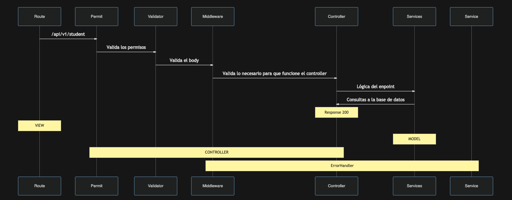
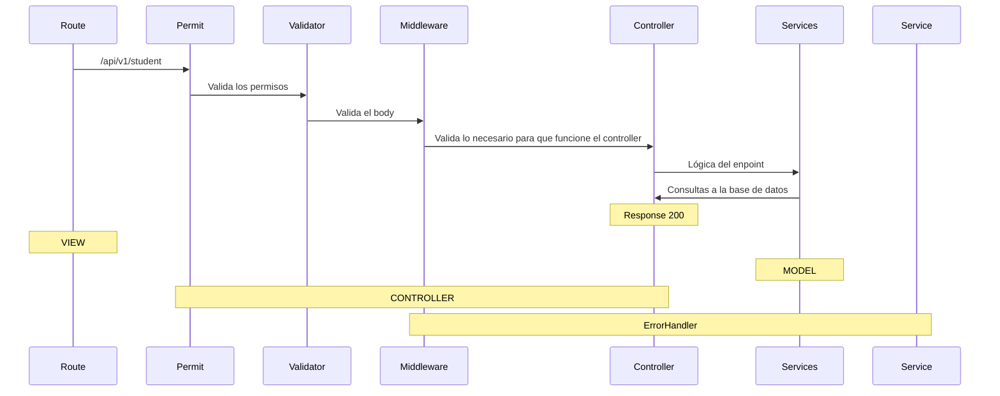

# Pocc Services

Tabla de contenido
* [Instalación](#install) 
* [Arquitectura y flujo](#flow)
* [Estructura de folders](#structure)

<a name="install"></a>
# Instalación
Instalar las dependencias
```terminal
$ yarn install
```
Se necesitan variables de entorno para conectarte a la base de datos y un whitelist
```
WHITELIST=http://localhost:3000,http://localhost:8080
ATLAS_USER=""
ATLAS_PASSWORD=""
```
Para correr en modo develop
```terminal
$ yarn dev
```

<a name="flow"></a>
# Arquitectura MVC y Flujo General.





<a name="structure"></a>
# Estructura de folders

    .
    ├── config.js     # Configuración para conectarse a la base de datos.
    ├── controllers   # Logica de los enpoints
    ├── errors        # Manejador de respuestas para errores genericos           
    ├── middlewares   # Middlewares de modelos y auth
    ├── validators    # Validators de body
    ├── models        # Modelos de la base de datos
    ├── routes        # Rutas de la API
    ├── server        # Configuración inicial de todo el server
    ├── services      # Consultas a las base de datos
    ├── utils         # Utilidades comunes
    └── index.js      # Archivo que levanta el server

<a name="layers"></a>
## Capas
### server: 
> Configura e inicializa el server y la conexión a la base de datos, implementa las rutas y middlewares generales como sentry y whitelist.

### routes: 
> Crea las rutas destinadas y manda a llamar a los controllers, existen dos tipos de rutas `publicRoutes` y `privateRoutes`  

    .
    ├── ...
    ├── routes                    # Rutas de la API
    │   ├── ModelRoutes.js        # Convención del nombre
    │   ├── PublicRoutes.js       # Se mandan a llamar las rutas publicas
    │   ├── PrivateRoutes.js      # Se mandan a llamar las rutas privadas
    │   └── index.js              # Concentra las rutas privadas y privadas
    └── ...

### controllers: 
> Lleva la lógica de cada enpoint depende de los `services`para pdoer conectare a la base de datos, solo se ejcutan y pasa exitasamente por `validators` y `middlewares`

    .
    ├── ...
    ├── controllers                    # Logica de los enpoints
    │   └── ModelControlller.js        # Convención del nombre
    │   └── index.js                   # Concentra todo para importar más rápido
    └── ...


## models: 
> Modelos de la base de datos para mongoose

    .
    ├── ...
    ├── models                    # Modelos de la base de datos
    │   └── Model.js              # Convención del nombre
    │   └── index.js              # Concentra todo para importar más rápido
    └── ...

## services: 
> Capa que solo se dedica a hacer consultas a la base de datos

    .
    ├── ...
    ├── models                    # Consultas a las base de datos
    │   └── ModelService.js       # Convención del nombre
    │   └── index.js              # Concentra todo para importar más rápido
    └── ...

## utils: 
> Scripts, archivos o funciones que se ocupan genericamente

    .
    ├── ...
    ├── utls                    # Utilidades comunes
    │   ├── const.js            # Constantes del proyecto
    │   ├── ...                 # Archivos o funciones genericas
    └── ...

## middlewares: 
> Funciones que se encargan de validar querys comunes a la base de dato y lo agregan al objeto `req`

    .
    ├── ...
    ├── middlewares               # Middlewares de modelos y auth
    │   ├── checkToken.js         # Valida el jwt
    │   └── ModelMiddleware.js    # Convención del nombre.
    └── ...

## validators: 
> Se encargan de validar el body que el usuario envia, tipo de datos y contenido

    .
    ├── ...
    ├── validators                # Validators de body
    │   └── ModelValidator.js     # Convención del nombre
    └── ...
